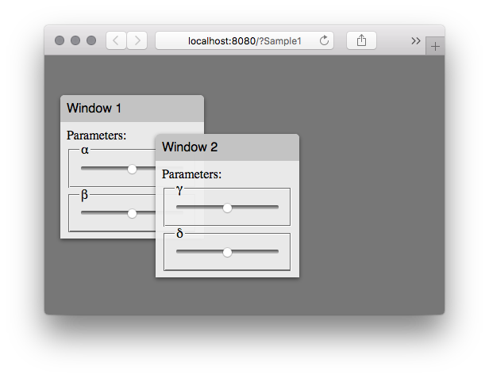

# vue-window
## Introduction
Recent web applications are mainly for mobile environments. Therefore window UI is no longer mainstream.
However, window UI is still useful for professional web applications for PC environments.
This package is an implementation of window UI for PC environment as a Vue Component.

### [Working Demo](https://michitaro.github.io/vue-window)
### Features
* Window component for vue2
* Windows are draggable
* Automatic z-index control
* Resizable
* z-index group
* Configurable color theme
* Built-in 3 color themes
* Open / Close animation
* Tested on Safari10, Chrome60, Firefox55, IE11, Edge38 For PCs 
* iOS Support 🎉



# Usage
## Install
```sh
npm install --save @hscmap/vue-window
```

## Setup

### ES6 / TypeScript
```typescript
import Vue from 'vue'
import * as VueWindow from '@hscmap/vue-window'

Vue.use(VueWindow)
```

### CommonJS
```javascript
var Vue = require('vue')
Vue.use(require('@hscmap/vue-window'))
```

# Example
```html
<template>
    <hsc-window-style-metal>
        <hsc-window title="Window 1" >
            Parameters:
            <fieldset>
                <legend>&alpha;</legend>
                <input type="range" />
            </fieldset>
            <fieldset>
                <legend>&beta;</legend>
                <input type="range" />
            </fieldset>
        </hsc-window>
    </hsc-window-style-metal>
</template>
```

Other examples are available [here](http://michitaro.github.io/vue-window/).

see also [@hscmap/vue-menu](https://github.com/michitaro/vue-menu).
This is a menu UI component for vue2 with the same color themes.

# Contributing
Any comments, suggestions or PRs are welcome 😀
